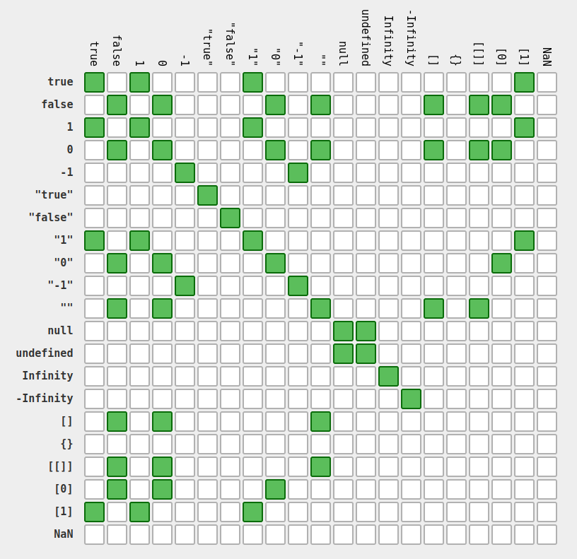

# Operators, comparison and coercion

[tsevdos.me](https://tsevdos.me/) / [@tsevdos](https://twitter.com/tsevdos)

---

# Rules

Feel free to interrupt me for:

- questions
- relevant comments

---

# Agenda

- type conversion and coercion
- operators

---

# Type conversion and coercion

```js
true + false;
12 / "6";
"number" + 15 + 3;
15 + 3 + "number"[1] > null;
"foo" + +"bar";
true == [1];
[] == "";
null == "";
```

---

# Type conversion and coercion



- [Source](https://dorey.github.io/JavaScript-Equality-Table/)

---

# Operators

- assignment operators
- comparison operators
- arithmetic operators
- logical operators
- string operators
- conditional (ternary) operator
- other operators

---

# Operators: Assignment operators

### Assignment operator: =

```js
let x = "my value";
```

### Addition assignment operator: +=

```js
x += 2; // x = x + 2.
```

---

# Operators: Assignment operators

### Subtraction assignment operator: -=

```js
x -= 2; // x = x - 2.
```

### Multiplication assignment operator: \*=

```js
x *= 2; // x = x * 2.
```

---

# Operators: Assignment operators

### Division assignment operator: /=

```js
x /= 2; // x = x / 2.
```

### Remainder assignment operator: %=

```js
x %= 2; // x = x % 2.
```

---

# Operators: Assignment operators

### Exponentiation assignment operator: \*\*=

```js
x **= 2; // x = x ** 2.
```

### Logical "AND" assignment operator: &&=

```js
x &&= 2; // x = x && 2.
// example
let x = true;
x &&= 2; // result x = 2
```

---

# Operators: Assignment operators

### Logical "OR" assignment operator: ||=

```js
x ||= 2; // x = x || 2.
// example
let x = false;
x ||= 3; // result x = 3
```

### Nullish coalescing operator: ??=

```js
x ??= 2; // x = x ?? 2.
// example
let x = null;
x ??= 2; // result x= 2
```

---

# Operators: Comparison operators

### Equal: ==

```js
3 == 3;
"3" == 3;
```

**Note: Don't use it!**

### Not equal: !=

```js
3 != 3;
"test" != 0;
```

**Note: Don't use it!**

---

# Operators: Comparison operators

### Strict equal: ===

```js
3 === 3;
"3" === 3;
```

### Strict not equal: !==

```js
3 !== 3;
"test" !== 0;
```

---

# Operators: Comparison operators

### Greater than: >

```js
4 > 3;
3 > 3;
```

### Greater than or equal: >=

```js
4 >= 3;
3 >= 3;
```

---

# Operators: Comparison operators

### Less than: <

```js
4 < 2;
3 < 3;
```

### GLess than or equal: <=

```js
4 <= 2;
3 <= 3;
```

---

# Operators: Arithmetic operators

### Addition: +

```js
2 + 3;
```

### Subtraction: -

```js
5 - 3;
```

### Multiplication: \*

```js
3 * 5;
```

---

# Operators: Arithmetic operators

### Division: /

```js
10 / 5;
```

### Remainder: %

```js
12 % 5; // returns 2
10 % 2; // returns 0
```

### Exponentiation operator: \*\*

```js
2 ** 3; // returns 8.
3 ** 3; // returns 27.
```

---

# Operators: Arithmetic operators

### Increment: ++

```js
let x = 3;
++x; // x is 4;

let y = 2;
y++; // returns 2 but sets y to 3
```

---

# Operators: Arithmetic operators

### Decrement: --

```js
let x = 3;
--x; // x is 2;

let y = 2;
y--; // returns 2 but sets y to 1
```

---

# Operators: Logical operators

### Logical AND: &&

```js
expr1 && expr2;

true && true; // true
true && false; // false
true && 1; // 1
true && fn(); // runs fn!
```

### Logical OR: ||

```js
expr1 || expr2;

true || true; // true
true || false; // true
false || false; // false
1 || false; // 1
```

---

# Operators: Logical operators

### Nullish coalescing operator: ??

```js
expr1 ?? expr2;

let number1 = undefined ?? 0; // 0
let number2 = null ?? 0; // 0

let tax = 0.35;
let tax2 = tax ?? 0.24;
```

### Logical NOT: !

```js
!expr;

!true;
!false;
```

---

# Operators: String operators

### Concatenation operator: +

```js
"Hello" + " World!";
```

### Shorthand assignment concatenation: +=

```js
let mystring = "alpha";
mystring += "bet";
```

---

# Operators: Conditional (ternary) operator

```js
condition ? val1 : val2;

const person = age >= 18 ? "adult" : "kid";
```

---

# Operators: Other operators

### Grouping operator: ()

```js
let a = 1;
let b = 2;
let c = 3;

let result1 = a + b * c; // 7
let result2 = (a + b) * c; // 9
```

### Optional chaining: ?.

```js
maybeObject?.property;
maybeObject?.[property];
maybeFunction?.();
```

---

# Workshop

- demo

---

# Happy coding!
